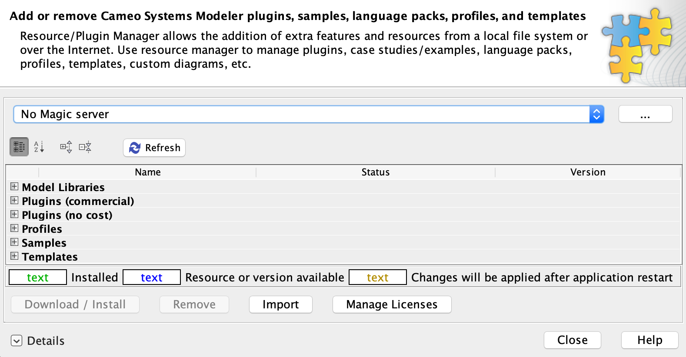

# Cameo MDK Expression

   

[AsciiMathML](http://asciimath.org/) based expression editor. Cameo MDK Expression is a plugin for [Cameo Systems Modeler](https://www.nomagic.com/products/cameo-systems-modeler) and other No Magic environment bundles.

# Quickstart

## Prerequisites

* [Cameo Systems Modeler (CSM)](https://www.nomagic.com/products/cameo-systems-modeler) or another No Magic environment bundle that includes the [SysML plugin](https://www.nomagic.com/product-addons/magicdraw-addons/sysml-plugin)
    * The latest Cameo MDK Expression version is tested with and supports **19.0 SP3**. Compatibility for previous versions of Cameo MDK Expression can be found in the [compatibility matrices](https://github.com/Open-MBEE/open-mbee.github.io/wiki/Compatibilities).

## Installation

1. [Download](https://bintray.com/openmbee/maven/mdk-expression/_latestVersion) the Cameo MDK Expression plugin, e.g. `mdk-expression-*-plugin.zip`.

2. Run CSM. From the main menu, select "Help" > "Resource/Plugin Manager".
   
   
3. Click "Import", navigate to the downloaded Cameo MDK Expression plugin, and click "Open".

4. CSM should confirm installation with the following prompt.

   
   
5. Restart CSM. To check installation, select from the main menu "Help" > "Resource/Plugin Manager" > "Plugins (no cost)" and ensure a row exists for "MDK Expression" and its status is "Installed" with the correct version.
  
  
> Cameo MDK Expression can also be installed headlessly by simply unzipping the plugin archive into the directory that CSM is installed in.
  
## Usage

Documentation can be accessed [online](src/main/dist/manual) or offline in CSM from the main menu "Help" > "Other Documentation" > "MDK [...] UserGuide".

# Local Development

Cameo MDK Expression is a Java project that uses the [Gradle](https://gradle.org/) build tool. It can be imported as a Gradle project in IDEs like [IntelliJ](https://www.jetbrains.com/idea/) and [Eclipse](https://www.eclipse.org/ide/).

## Common Tasks
* `./gradlew dependencies` will download all necessary dependencies.
* `./gradlew assemble` will compile the plugin from source.
* `./gradlew distZip` will package the installable plugin.
* `./gradlew installDist` will install the plugin in a staging environment.
* `./gradlew runJava` will interactively run CSM with the plugin installed from the staging environment.

Task dependencies are declared such that all necessary prerequisites are executed/cached, e.g. `runJava` will first `dependencies`, `assemble`, `distZip`, etc.
